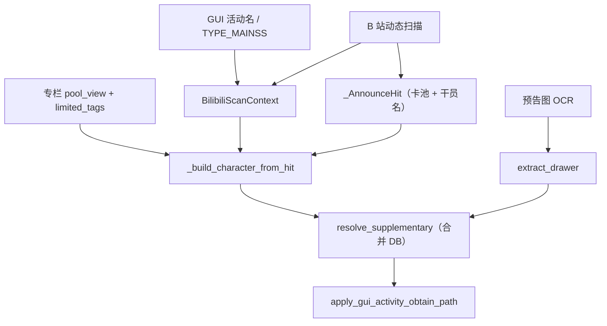

# 明日方舟工具箱 — B 站补充数据与 OCR 改动汇总

> 整理日期：2026-06-02  
> 范围：获取途径 / 联动判定 / 限定寻访专栏 / 主题曲奖励 / 画师 OCR

---

## 1. 项目模块一览

| 模块 | 路径 | 职责 |
|------|------|------|
| B 站扫描上下文与获取途径 | `shared/services/bilibili_service.py` | `BilibiliScanContext`、活动名解析、获取途径模板 |
| 动态抓取与干员构建 | `shared/services/bilibili_supplementary_fetch.py` | 扫描预告、专栏卡池、`_build_character_from_hit` |
| 补充数据编排 | `core/character_script/resolve_supplementary.py` | DB + B 站合并、GUI 活动覆盖 |
| 画师文本解析（无 Paddle） | `shared/ocr_profile_fields.py` | `extract_drawer`、绘制/原案行解析 |
| OCR 入口 | `shared/services/ocr_service.py` | `ocr_operator_profile`、专精 + 画师 |
| GUI | `gui/ark_gui_mock.py` | 活动筛选、`TYPE_MAINSS` → 主题曲标志 |
| 活动库 | `data/db/activity_repo.py` | MySQL `activities` 只读列表 |
| 测试 | `test/test_bilibili_side_story.py` | 获取途径、专栏、联动 |
| 测试 | `test/test_ocr_drawer_extract.py` | 画师 OCR 解析 |

---

## 2. 数据流



---

## 3. 问题与解决

### 3.1 GUI 活动名被 B 站 SideStory 缓存覆盖

**现象**  
GUI 选择「相变临界」时，维伊等仍写出 `活动获取、【人们，我们】活动获取`（来自 feed 里 `SideStory「人们，我们」`）。

**原因**  
`resolve_collab_activity_name` 在命中 SideStory 时用缓存活动名；合并阶段未强制 GUI 名。

**解决**

- `BilibiliScanContext.gui_activity_name` 在解析活动名时**最高优先级**。
- 合并后调用 `apply_gui_activity_obtain_path`，把已有「活动获取」里的活动短名替换为 GUI 库表名。

```python
# shared/services/bilibili_service.py — apply_gui_activity_obtain_path
def apply_gui_activity_obtain_path(
    value: dict[str, Any],
    gui_activity_name: str | None,
    *,
    gui_activity_is_main_theme: bool = False,
) -> dict[str, Any]:
    gui = (gui_activity_name or "").strip()
    if not gui:
        return value
    obtain = str(value.get("获取途径") or "")
    out = dict(value)
    if (
        gui_activity_is_main_theme
        and ("活动获取" in obtain or "活动获得" in obtain)
        and "联动" not in obtain
    ):
        out["获取途径"] = _main_theme_reward_obtain_path(gui)
        return out
    if "主题曲获取" in obtain or "主题曲获得" in obtain:
        out["获取途径"] = _main_theme_reward_obtain_path(gui)
        return out
    if "活动获取" not in obtain and "活动获得" not in obtain:
        return value
    if "、活动获取、联动" in obtain:
        out["获取途径"] = f"【{gui}】活动获取、活动获取、联动"
    else:
        prefix = ACQUISITION_METHOD.get("活动奖励干员", "活动获取、【")
        out["获取途径"] = prefix + gui + "】活动获取"
    return out
```

---

### 3.2 主题曲奖励干员（维伊 / 相变临界）

**现象**  
应输出 `【相变临界】主题曲获取、主题曲获取`，实际为 `活动获取、【相变临界】活动获取` 或 `【人们，我们】活动获取`。

**原因**  
- 动态卡池为 `活动奖励干员`，`side_story` 为空或 SideStory 与 GUI 主题曲不一致。  
- 未识别 `主题曲奖励干员` 卡池类型。  
- GUI 选 `TYPE_MAINSS` 活动未传入扫描上下文。

**解决**

```python
# shared/services/bilibili_service.py
def should_use_main_theme_reward_obtain(
    gacha_pool: str,
    side_story: str | None,
    scan_ctx: BilibiliScanContext | None = None,
) -> bool:
    pool = (gacha_pool or "").strip()
    if pool == "主题曲奖励干员":
        return True
    if pool != "活动奖励干员":
        return False
    if _is_main_theme_context(side_story, scan_ctx):
        return True
    if scan_ctx is None:
        return False
    if scan_ctx.gui_activity_is_main_theme and (scan_ctx.gui_activity_name or "").strip():
        return True
    gui = (scan_ctx.gui_activity_name or "").strip()
    cached_mt = (scan_ctx.cached_main_theme_activity_name or "").strip()
    return bool(gui and cached_mt and gui == cached_mt)

def _main_theme_reward_obtain_path(activity_name: str | None) -> str:
    name = (activity_name or "").strip()
    if name:
        return f"【{name}】主题曲获取、主题曲获取"
    return "主题曲获取"
```

```python
# gui/ark_gui_mock.py — 传入 pipeline
activity_is_main_theme = (
    activity.act_type == "TYPE_MAINSS" if activity else False
)
```

```python
# shared/services/bilibili_supplementary_fetch.py — 抓取分支（节选）
elif should_use_main_theme_reward_obtain(gacha_pool, hit.side_story, scan_ctx):
    reward_activity = resolve_activity_reward_name(
        side_story=hit.side_story, scan_ctx=scan_ctx
    )
    log_info(
        "main_theme_reward name=%s pool=%s activity=%s gui=%s side_story=%s",
        name, gacha_pool, reward_activity,
        (scan_ctx.gui_activity_name if scan_ctx else None),
        hit.side_story,
    )
    character["获取途径"] = _main_theme_reward_obtain_path(reward_activity)
```

**日志关键字**：`main_theme_reward`

---

### 3.3 联动期「新增干员」误写联动寻访

**现象**  
非 `【明日方舟 × …】` 动态里的新增干员出现 `联动、联动寻访、【定向甄选】寻访`。

**原因**  
feed 同期存在联动池名 `cached_collab_gacha_pools`，未区分「本条动态是否联动」。

**解决**  
- 仅 `hit.is_collab` 时：`named_collab_pool` / `collab_standard_pool` 写联动寻访。  
- 非 × 动态 + 同期有池名 + `新增干员` → `collab_period_new_ops`：`标准寻访` + `联动=True`（角标「联」）。

---

### 3.4 限定寻访：怒潮凛冬 / 辟路之人

**现象**  
怒潮凛冬为 `限定寻访、【辟路之人】限定寻访`，实际应为池内 UP、**标准寻访**。

**原因 1 — 专栏 key 错位**  
`_load_pool_view` 用标题**第一个** `【】` 作 key（常为 `限定寻访·庆典`），预告为 `【辟路之人】` → `pool_view.get("辟路之人")` 为空，走命名池兜底一律限定。

**原因 2 — 空 `[限定]` 名单**  
旧逻辑：`not limited_in_pool` 时整池算限定。

**原因 3 — 子串误匹配**  
`lim in name` 使专栏 `凛冬` 误匹配 `怒潮凛冬`。

**解决**

```python
# shared/services/bilibili_service.py — 从摘要解析真实卡池名
_ARTICLE_POOL_IN_SUMMARY_RE = re.compile(r"-【([^】]+)】寻访")

def extract_article_pool_keys(title: str, summary: str) -> tuple[str | None, str | None]:
    pool_name = None
    m = _ARTICLE_POOL_IN_SUMMARY_RE.search(summary or "")
    if m:
        pool_name = (m.group(1) or "").strip() or None
    # 标题中非「限定寻访·*」的【】作为备选
    ...
    banner_type = None  # 【限定寻访·庆典】等
    ...
    return pool_name, banner_type
```

```python
# shared/services/bilibili_service.py — 限定名单匹配
def _is_limited_operator_in_pool(name: str, limited_names: set[str]) -> bool:
    name = (name or "").strip()
    if not name or not limited_names:
        return False
    if name in limited_names:
        return True
    norm_name = _normalize_operator_name(name)
    for lim in limited_names:
        lim = (lim or "").strip()
        if not lim:
            continue
        if norm_name == _normalize_operator_name(lim):
            return True
        # 仅「预告名 ⊂ 专栏全名」，不用 lim in name
        if len(name) >= 2 and name in lim:
            return True
    return False
```

```python
# shared/services/bilibili_supplementary_fetch.py — 仅 [限定] 名单内为限定
is_limited = bool(
    limited_in_pool
    and prefix is not None
    and _is_limited_operator_in_pool(name, limited_in_pool)
)
log_info(
    "pool_obtain name=%s pool=%s banner=%s limited_tags=%s is_limited=%s",
    name, gacha_pool, implementation_data[0],
    sorted(limited_in_pool) or None, is_limited,
)
if is_limited:
    character["获取途径"] = prefix + f"{gacha_pool}】限定寻访"
else:
    character["获取途径"] = acquisition_method.get("新增干员", "标准寻访")
```

```python
# shared/services/bilibili_service.py — 无专栏匹配时不臆断限定
def _obtain_path_for_gacha_pool(...):
    ...
    if gacha_pool:
        return acquisition_method.get("新增干员", "标准寻访")
```

**日志关键字**：`pool_obtain`、`pool_obtain_fallback`

---

### 3.5 扫描缓存：主题曲污染 SideStory

**现象**  
feed 中 `主题曲「相变临界」` 覆盖 `cached_side_story`，后续活动奖励用错活动名。

**解决**（`refresh_scan_activity_cache`）

- 仅 `SideStory「…」` → `cached_side_story` / `cached_activity_name`。  
- `主题曲「…」` → `cached_main_theme_activity_name`，**不**覆盖 SideStory。  
- prefill 在已有 SideStory 时跳过。

---

### 3.6 画师 OCR：贝洛内（制 / LoWro / 009）

**现象**  
- OCR 行：`P` → `制` → `LoWro` → `009`，无完整「绘制」。  
- 跳过「制」后仍续读多行，曾得到 `LoWro、009`。  
- 或终端有 `LoWro` 仍「未识别画师」（旧进程未加载弱标签逻辑）。

**解决**（`shared/ocr_profile_fields.py`）

| 优先级 | 规则 |
|--------|------|
| 1 | 完整行匹配 `绘制` / `绑制` / `原案` |
| 2 | 标签残片（`制绘绑案`）后**只读紧邻 1 行** |
| 3 | 无完整标签：`制` 或 `P`+`制` 弱锚点 |
| 4 | 纯数字（`009`）不当画师；残片不当画师名 |

```python
_LABEL_FRAGMENT_CHARS = frozenset("制绘绑案")

def _collect_names_after_label(...):
    awaiting_after_fragment = False
    while j < len(lines) and taken < max_follow:
        ...
        if _is_label_fragment_line(ln):
            saw_fragment = True
            awaiting_after_fragment = True
            j += 1
            continue
        if awaiting_after_fragment:
            awaiting_after_fragment = False
            if _looks_like_artist_name_line(raw, ...):
                _append_name(names, raw, ...)
                taken += 1
            elif warn is not None:
                warn("ocr_drawer_after_fragment_rejected line=%s", ln)
            j += 1
            break  # 不再读 009、ROanG 等
        ...
```

```python
def _find_weak_draw_label_index(lines: list[str]) -> int | None:
    for i, line in enumerate(lines):
        if _DRAW_LABEL_RE.match(line):
            continue
        if _is_weak_draw_label_line(line):
            return i
        if _is_split_draw_label_pair(lines, i):  # P + 制
            return i
    return None
```

```python
# shared/services/ocr_service.py
drawer = extract_drawer(merged, warn=log_warning) or ""
```

**日志关键字**  
`ocr_drawer_weak_label`、`ocr_drawer_after_fragment_rejected`、`ocr_drawer_label_fragment_no_name`、`ocr_drawer_single_char_name`

**贝洛内预期**：`画师 = LoWro`（不含 `009`）。

---

### 3.7 其它修复（简表）

| 问题 | 处理 |
|------|------|
| `scan_ctx` 仅活动筛选才创建 | `fallback_bilibili` 时始终 `BilibiliScanContext` |
| 罗德岛隐秘队抓不到动态 | `discovered_dynamic_ids`、预告名 strip、按 id 对齐 |
| `_build_character_from_hit` 中 `log_info` 未定义 | 传入 `log_info` 回调 |
| 画师行前导 `-` | `_clean_ocr_name_line` |
| 活动列表 GUI | `activities` 表 + 与 `character_num` 互斥的时间窗 |

---

## 4. `BilibiliScanContext` 字段说明

| 字段 | 含义 |
|------|------|
| `gui_activity_name` | GUI 所选活动名（最高优先） |
| `gui_activity_is_main_theme` | `TYPE_MAINSS` 主题曲篇章 |
| `cached_side_story` | 仅 SideStory 原文 |
| `cached_activity_name` | SideStory 短名或联动活动名 |
| `cached_main_theme_activity_name` | 主题曲「…」短名 |
| `cached_collab_gacha_pools` | 联动公告池名集合 |
| `discovered_dynamic_ids` | 发现阶段 干员名 → 动态 id |

---

## 5. 获取途径判定顺序（`_build_character_from_hit`）

1. 联动命名池（× 动态 + 非标准卡池名）  
2. 联动标准池（× 动态 + 新增/活动/主题曲奖励）  
3. 主题曲奖励（`should_use_main_theme_reward_obtain`）  
4. 普通活动奖励干员  
5. 联动期非 × 新增干员 → 标准寻访 + 联  
6. 专栏 `pool_view` / `pool_limited_ops` + `[限定]` 名单  
7. 兜底 `_obtain_path_for_gacha_pool`（无专栏 → 标准寻访）

---

## 6. 测试与验证

```bash
python -m pytest test/test_bilibili_side_story.py test/test_ocr_drawer_extract.py -q
```

| 场景 | 期望 log | 期望结果 |
|------|----------|----------|
| GUI 相变临界 + 维伊 | `main_theme_reward` | `【相变临界】主题曲获取、主题曲获取` |
| 怒潮凛冬 / 辟路之人 | `pool_obtain ... is_limited=False` | `标准寻访` |
| 贝洛内 OCR | `ocr_drawer_weak_label line=制` | `画师=LoWro` |
| 联动 × + 泡影苍霆活动奖励 | `collab_activity_reward` | `【名】活动获取、活动获取、联动` |

**注意**

1. 修改代码后需**重启 GUI 进程**。  
2. DB 中旧的 `operator_supplementary` 需重新抓取或清空字段后才会更新。  
3. 日志文件：`log/YYYY-MM-DD.log`。

---

## 7. 相关提交文件清单（便于 code review）

```
shared/services/bilibili_service.py
shared/services/bilibili_supplementary_fetch.py
shared/ocr_profile_fields.py
shared/services/ocr_service.py
core/character_script/resolve_supplementary.py
core/character_script/pipeline.py
gui/ark_gui_mock.py
test/test_bilibili_side_story.py
test/test_ocr_drawer_extract.py
```

---

*文档由开发会话整理，如有新活动类型或 B 站版式变更，请优先更新 `extract_article_pool_keys` 与 `_DRAW_LABEL_RE`。*
